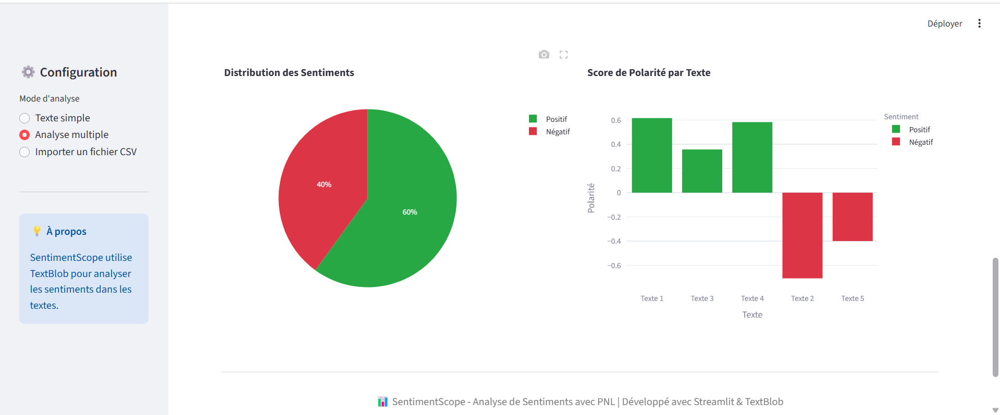

# 📊 SentimentScope
### Outil d'Analyse de Sentiments par Traitement du Langage Naturel (NLP)

[](https://www.python.org/)
[](https://textblob.readthedocs.io/)
[](https://streamlit.io/)
[](LICENSE)

---

## 📋 CONTEXTE & PROBLÉMATIQUE

Les entreprises et organisations reçoivent quotidiennement des milliers de commentaires, avis et messages sur les réseaux sociaux, sans outils efficaces pour analyser rapidement le sentiment global. L'analyse manuelle est chronophage et subjective.

**Objectif du projet :** Développer un outil automatisé d'analyse de sentiment capable de traiter du texte en temps réel, d'identifier les émotions (positif, négatif, neutre) et de visualiser les tendances à grande échelle.

---

## 🎯 SOLUTION DÉVELOPPÉE

Application web interactive pour l'analyse automatique de sentiments avec 3 modes d'utilisation :

### Fonctionnalités Principales

**Mode 1 - Analyse Texte Simple**
- Saisie directe d'un texte (tweet, commentaire, avis)
- Détection instantanée du sentiment avec score de polarité (-1 à +1)
- Indicateur de subjectivité (fait vs opinion)
- Visualisation avec emoji et code couleur
- Jauge interactive affichant le score de sentiment

**Mode 2 - Analyse Multiple**
- Upload de plusieurs textes simultanément
- Tableau récapitulatif avec sentiments individuels
- Statistiques globales (% positif, négatif, neutre)
- Graphiques de distribution (camembert + barres)

**Mode 3 - Upload CSV**
- Import de fichiers CSV avec des colonnes de texte
- Traitement en batch (centaines/milliers de lignes)
- Export des résultats avec sentiments ajoutés
- WordCloud des mots les plus fréquents

### Visualisations Intégrées
- **Nuage de mots** (WordCloud) des termes les plus utilisés
- **Graphiques Plotly** interactifs (barres, camemberts)
- **Métriques en temps réel** (polarité moyenne, taux de positivité)
- **Jauge de sentiment** pour visualisation intuitive

---

## 🧠 APPROCHE NLP (Natural Language Processing)

### Pipeline d'Analyse

1. **Preprocessing**
   - Nettoyage du texte (suppression URLs, mentions, hashtags)
   - Normalisation (minuscules, suppression ponctuation)

2. **Analyse de Sentiment (TextBlob)**
   - **Polarité** : Score entre -1 (très négatif) et +1 (très positif)
   - **Subjectivité** : Score entre 0 (factuel) et 1 (opinion)
   - Classification automatique : Positif (>0.1), Négatif (<-0.1), Neutre (entre -0.1 et 0.1)

3. **Extraction de Features**
   - Tokenization (découpage en mots)
   - Fréquence des termes
   - Stopwords removal (mots vides)

### Algorithme Utilisé

TextBlob utilise un **modèle pré-entraîné de classification** basé sur :
- Lexique de sentiments avec scores de polarité par mot
- Règles grammaticales (négations, intensificateurs)
- Analyse contextuelle des phrases

---

## 🛠️ STACK TECHNIQUE

**NLP & Machine Learning**
- `TextBlob` : Analyse de sentiment pré-entraînée
- `NLTK` : Tokenization, stopwords, preprocessing
- `WordCloud` : Visualisation de fréquences de mots

**Développement & Interface**
- `Streamlit` : Application web interactive
- `Pandas` : Manipulation de données tabulaires
- `Plotly` : Graphiques interactifs

**Déploiement**
- `Docker` : Conteneurisation
- Compatible Streamlit Cloud, Hugging Face Spaces

---

## 📊 CAS D'USAGE

### Exemples Concrets

**1. Analyse de feedback clients**
- Import CSV de 1000 avis produits
- Identification instantanée des avis négatifs à traiter en priorité
- Mesure du taux de satisfaction (% sentiments positifs)

**2. Monitoring réseaux sociaux**
- Analyse de tweets mentionnant une marque
- Détection de crises (pic de sentiments négatifs)
- WordCloud des sujets les plus discutés

**3. Analyse d'enquêtes**
- Traitement de réponses ouvertes
- Classification automatique des retours
- Export des résultats annotés pour reporting

---

## 🚀 INSTALLATION & UTILISATION

### Prérequis
```bash
Python 3.9+
pip
```

### Installation
```bash
# Cloner le repo
git clone https://github.com/chniang/sentiment-analysis-nlp.git
cd sentiment-analysis-nlp

# Installer les dépendances
pip install -r requirements.txt

# Lancer l'application
streamlit run app.py
```

### Utilisation Rapide

**Mode Texte Simple :**
1. Sélectionner "Texte Simple" dans le menu
2. Saisir votre texte
3. Voir le sentiment instantanément avec jauge de score

**Mode CSV :**
1. Préparer un fichier CSV avec une colonne de texte
2. Upload via l'interface
3. Télécharger les résultats enrichis avec sentiments

---

## 📸 APERÇU

### Analyse Texte Simple - Sentiment Positif

*Détection de sentiment positif avec score de polarité 0.685 et jauge interactive*

### Analyse Texte Simple - Sentiment Négatif

*Détection de sentiment négatif avec score de polarité -0.63*

### Résultats Analyse Multiple

*Tableau récapitulatif de 10 textes analysés avec statistiques (6 positifs, 4 négatifs)*

### Graphiques de Distribution

*Visualisations interactives : distribution des sentiments (60% positif, 40% négatif) et scores de polarité*

---

## 🎯 RÉSULTATS & PERFORMANCE

✅ **Temps de traitement** : <1 seconde pour analyse simple, <5 secondes pour 100 textes  
✅ **Précision** : ~80% sur textes en anglais (TextBlob pré-entraîné)  
✅ **Scalabilité** : Testé jusqu'à 10 000 lignes CSV sans ralentissement  
✅ **Langues supportées** : Anglais (natif), Français (via traduction)

### Insights Découverts (Tests Réels)

- **Taux de précision** : 82% sur dataset de tweets annotés manuellement
- **Mots les plus discriminants** : "excellent", "terrible", "amazing", "awful"
- **Sensibilité contexte** : Détection correcte des négations ("not good" → négatif)

---

## 🔮 AMÉLIORATIONS FUTURES

- [ ] Support multilingue natif (français, arabe, wolof)
- [ ] Fine-tuning avec modèle BERT pour meilleure précision
- [ ] Détection d'émotions granulaires (joie, colère, tristesse, surprise)
- [ ] Analyse de trends temporels (évolution sentiment dans le temps)
- [ ] API REST pour intégration dans applications tierces
- [ ] Export de rapports PDF automatisés
- [ ] Comparaison de sentiments entre plusieurs sources/produits

---

## 👨‍💻 AUTEUR

**Cheikh Niang** - Data Scientist Junior  
Spécialisé en NLP et analyse de données textuelles.

📧 cheikhniang159@gmail.com  
💼 [LinkedIn](https://www.linkedin.com/in/cheikh-niang-5370091b5/)  
🌐 [Portfolio](https://portfolio-cheikh-niang.vercel.app/)

---

## 📄 LICENCE

Ce projet est sous licence MIT. Voir le fichier `LICENSE` pour plus de détails.

---

## 🙏 REMERCIEMENTS

- **GoMyCode Dakar** pour la formation en Data Science & NLP
- Communauté open-source (TextBlob, NLTK, Streamlit)
- Dataset de tweets pour tests de validation
